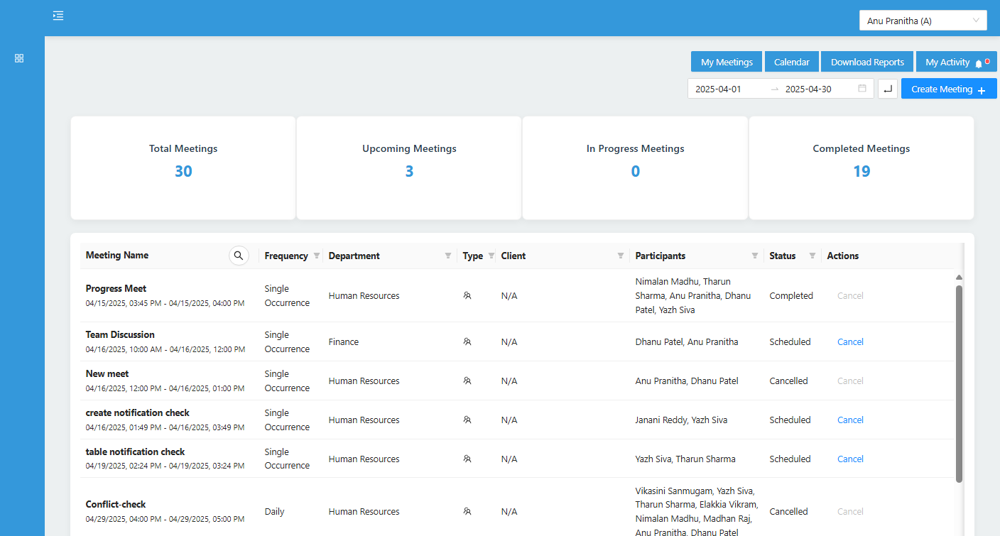
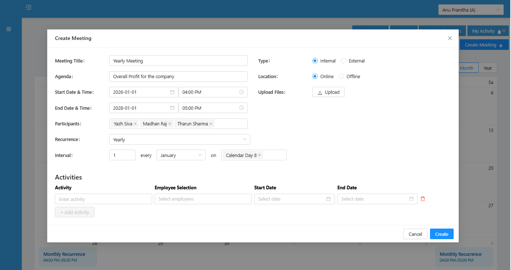
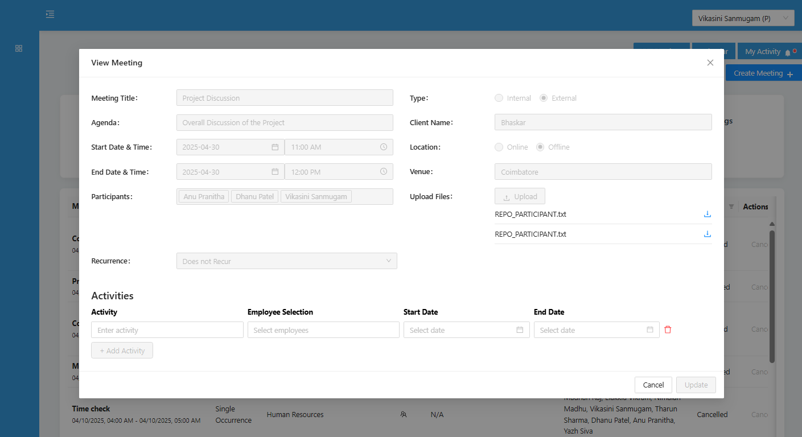
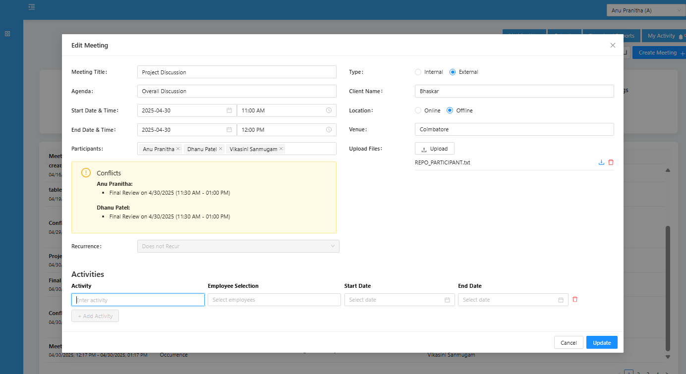
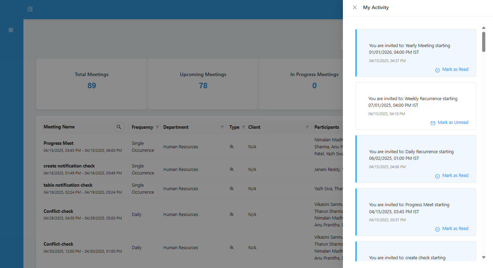
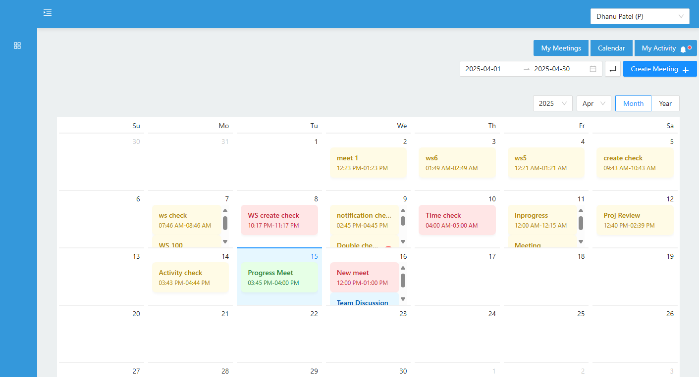
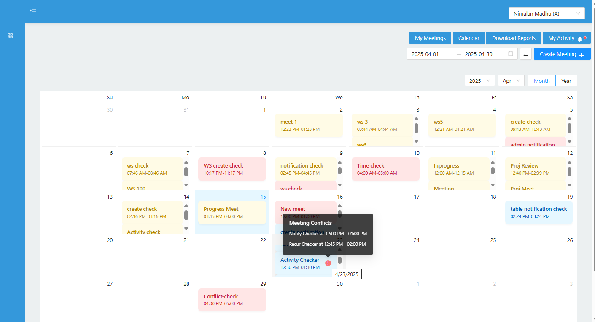
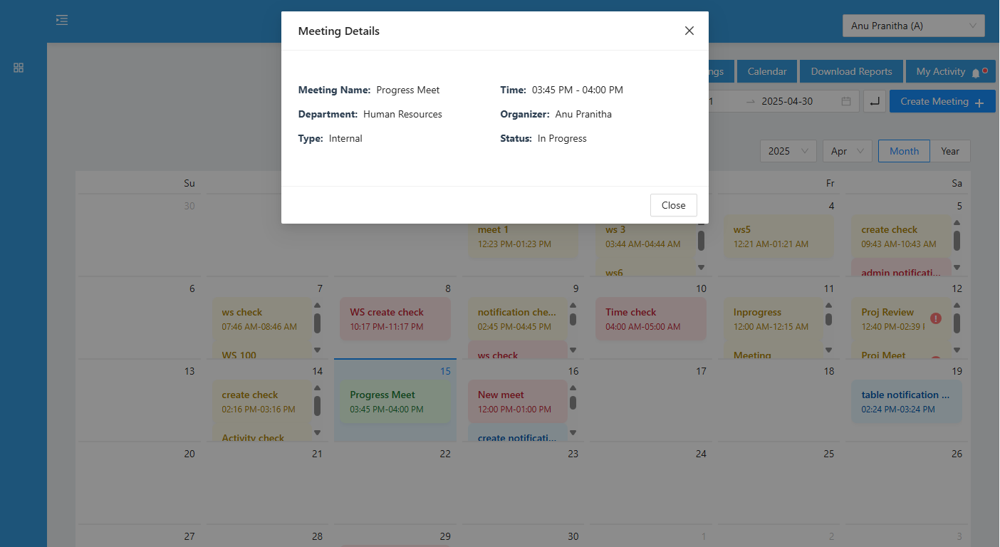

# Meeting Manager – Visual Demo

This document showcases the user interface and core functionalities of the Meeting Manager application.

---

## 1. Landing Page-Admin

---

## 2. Create Meeting

---

## 3. View Meeting Details

---

## 4. Edit Meeting with Conflict Detection

---

## 5. In-App Notification

---

## 6. Calendar View

---

## 7. Calendar with Conflicts

---

## 8. Calendar Day Click Details

